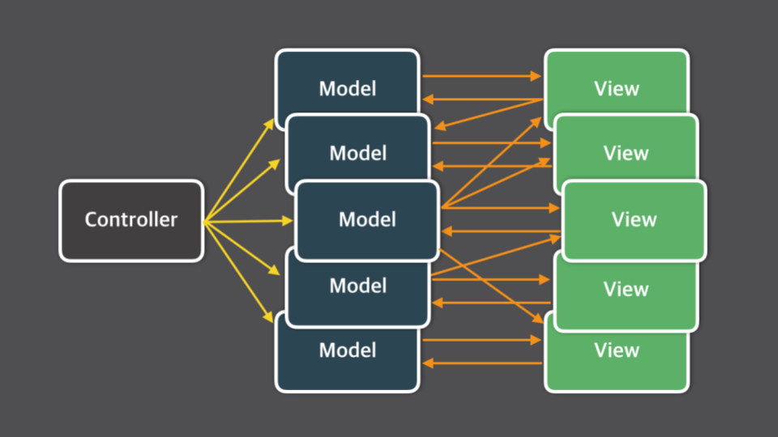
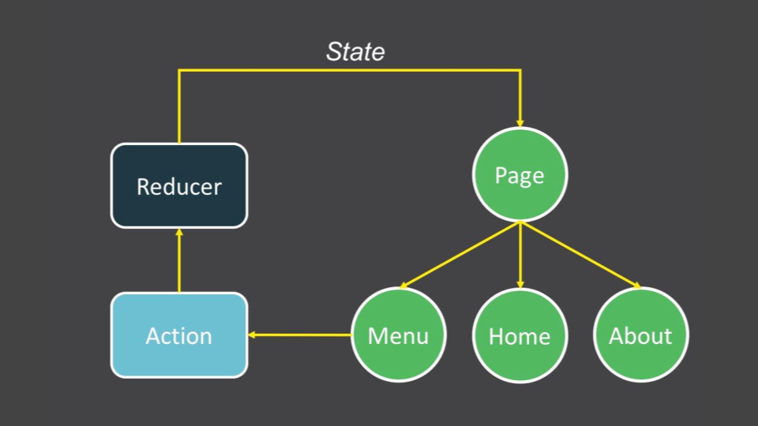
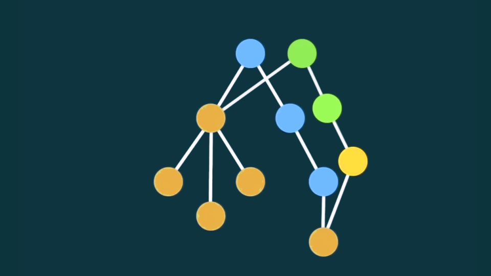

import { Head, Appear } from 'mdx-deck'

import { CounterWithUseState } from './examples/Hooks/CounterWithUseState'

export { default as theme } from './theme'

<Head>
  <title>New React API: enabling better patterns</title>
</Head>

# New React API: enabling better patterns

---

## New React API features

<ul>
  <Appear>
    <li>New Context API</li>
    <li>Suspense and Concurrent rendering</li>
    <li>lazy, memo, ...</li>
    <li>Hooks API</li>
  </Appear>
</ul>

---

## Broad picture...

---

## What is the greatest contribution of React?

---

> The most important thing that React brought to the community was the idea of
> **unidirectional data flow**.

by Igor Minar, Angular tech lead, [ReactiveConf 2016](https://youtu.be/41ffY2whXoU?t=576)

---

## Why? Long story short...

---


---



---


---


---



---

## Asynchronicity + mutation


http://redux.js.org/docs/introduction/Motivation.html

---

## Immutable data operations

---


---



---

## Immutable App Architecture
by Lee Byron

https://youtu.be/pLvrZPSzHxo

---

## ❤️ Redux
since 2015

---

[](public/images/react-redux-workflow-graphical-cheat-sheet.png)

---

## Too much boilerplate

<Appear>
  <div>Reducers</div>
  <div>Action type constats</div>
  <div>Action creators</div>
  <div>mapStateToProps</div>
  <div>mapDispatchToProps</div>
  <div>...</div>
</Appear>

---

## 💔 you might not need Redux
2016 - ?

---


---


---

## Thinking in React

https://reactjs.org/docs/thinking-in-react.html

---

## Redux benefits

<ul>
  <Appear>
    <li>Single state tree + immutable operations (inside reducers)</li>
    <li><strong>connect(&lt;YourComponent /&gt;)</strong> to state anywhere</li>
  </Appear>
</ul>

---

import { Counter } from './examples/Context/AppWithState.js';

```jsx
<Counter increment={2} />
```

<Counter increment={2} />

---

```jsx
import React from 'react';

export class Counter extends React.Component {
  state = {
    counter: 0
  }
  handleClick = () => {
    this.setState({counter: this.state.counter + this.props.increment})
  }
  render() {
    return <button onClick={this.handleClick}>{this.state.counter}</button>
  }
}
```

---

import { CodeSurfer } from "mdx-deck-code-surfer"
import snippet from '!raw-loader!./examples/Context/AppWithState.js';

<CodeSurfer
  code={snippet}
  lang="jsx"
  dark={false}
  steps={[
    {},
    { lines: [10,12], range: [4, 6], tokens: { 11: [15,16,17,18,19] }, notes: "Rendering state" },
    { lines: [10,12], range: [7, 9], tokens: { 11: [6,7,8,9,10,11,12] }, notes: "Updating state" },
    {}
  ]}
/>

---

Using object (may fail due to asynchronicity)

```jsx
this.setState(
  { counter: this.state.counter + this.props.increment }
);
```

Using function

```jsx
this.setState(
  (state) => ({
    ...state,
    counter: state.counter + this.props.increment
  })
);
```

---
## Extract action

```jsx
incrementAction = (state) => ({
  ...state,
  counter: state.counter + this.props.increment
})

...

this.setState(this.incrementAction);
```

---
## Action creator

```jsx
incrementAction = (increment) => (state) => ({
  ...state,
  counter: state.counter + increment
})

...

this.setState(this.incrementAction(this.props.increment));
```

---

### Familiar? (redux)

```jsx
const reducer = (state, action) => {
  switch (action.type) {
    case 'INCREMENT':
      return {
        ...state,
        counter: state.counter + 1
      };
      ...
    default:
      return state;
  }
}
```

---

## Redux benefits without Redux

<ul>
  <Appear>
    <div>✅ Single state tree + immutable operations (inside reducers)</div>
    <div>❓<strong>connect(&lt;YourComponent /&gt;)</strong> to state anywhere</div>
  </Appear>
</ul>
---

## connect() to the same state


---

## React Context

<Appear>
  <h3>this.context - experimental</h3>
  <h3>Stable Context API - React 16.3.0 (March 29, 2018)</h3>
</Appear>

---

## When to use Context

<ul>
  <Appear>
    <li>Share data that can be considered "global"</li>
    <li>Avoid passing props through multiple elements</li>
  </Appear>
</ul>

---

```jsx
const UserContext = React.createContext({
  user: 'Joe',
  ...
});

class App extends React.Component {
  render() {
    return (
      <UserContext.Provider value={{ user: 'Mike' }}>
        <Main />
      </UserContext.Provider>
    );
  }
}
```

---

```jsx
class Toolbar extends React.Component {
  render() {
    return (
      <div>
        ...
        <UserContext.Consumer>
          {
            ({ user }) => (
              <div>Hi {user}!</div>
            )
          }
        </UserContext.Consumer>
      </div>
    )
  }
}
```

---

```jsx
export const UserContext = React.createContext();

class App extends React.Component {
  state = { user: 'Mike' }
  handleLogout = () => {
    this.setState( state => ({...state, user: null}))
  }
  render() {
    return (
      <UserContext.Provider value={{ user: this.state.user, onLogout: this.handleLogout }}>
        <Main />
      </UserContext.Provider>
    );
  }
}
```

---

```jsx
class Toolbar extends React.Component {
  render() {
    return (
      <div>
        ...
        <UserContext.Consumer>
          {
            ({ user, onLogout }) => (
              <div>Hi {user}!
                <button onClick={onLogout}>Logout</button>
              </div>
            )
          }
        </UserContext.Consumer>
      </div>
    )
  }
}
```

---

## Extracting the "global" state

---

```jsx
// UserContext.js
import React from 'react';
const { Consumer, Provider } = React.createContext();

class UserProvider extends React.Component {
  state = { user: 'Mike' }
  handleLogout = () => {
    this.setState( state => ({...state, user: null}))
  }
  render() {
    <Provider value={
      user: this.state.user,
      onLogout: this.handleLogout
    }>{this.props.children}</Provider>
  }
}

export { UserProvider, Consumer as UserConsumer }
```

---
```jsx
import { UserProvider } from './UserContext'

class App extends React.Component {
  render() {
    return (
      <UserProvider>
        <Main />
      </UserProvider>
    );
  }
}
```

---

```jsx
import { UserConsumer } from './UserContext'
class Toolbar extends React.Component {
  render() {
    return (
      <div>
        ...
        <UserConsumer>
          {
            ({ user, onLogout }) => (
              <div>Hi {user}!
                <button onClick={onLogout}>Logout</button>
              </div>
            )
          }
        </UserConsumer>
      </div>
    )
  }
}
```

---
## Using useState

```jsx
import React, {useState} from 'react';

export const Counter = () => {
  const [counter, setCounter] =  useState(0);
  return (<button onClick={() => setCounter(counter + 1)}>{counter}</button>);
}
```

<CounterWithUseState />

---

## Edit this file

To create your presentation

```notes
- Create speaker notes in fenced code blocks
```

---

<https://github.com/jxnblk/mdx-deck>
